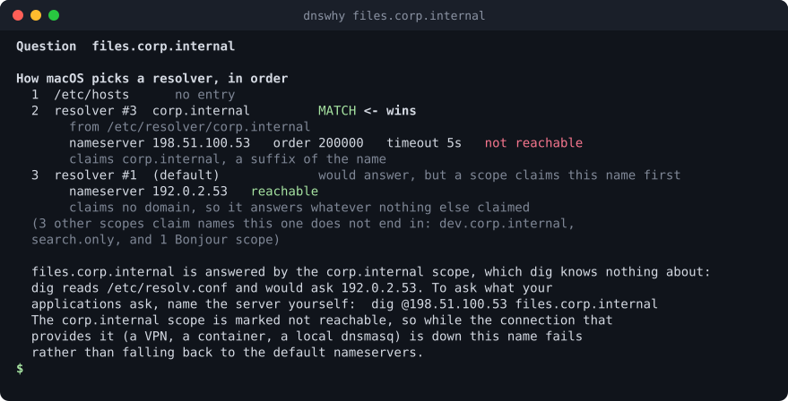
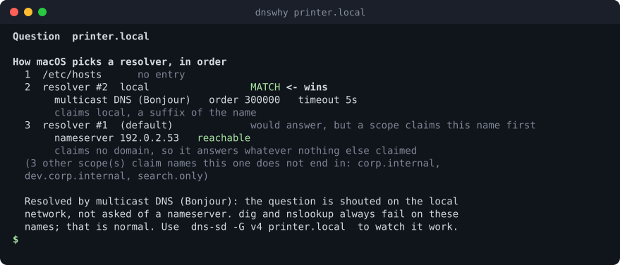
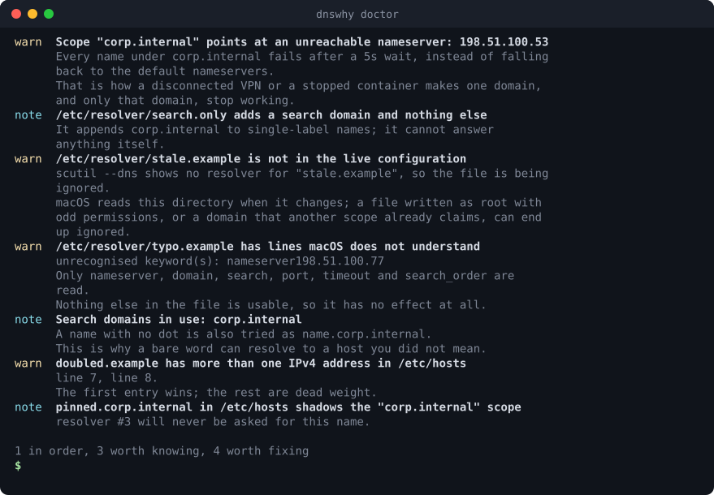

# dnswhy

**Why does this Mac resolve that name the way it does?**

<p align="center"></p>

On a Mac, `dig` and your applications do not ask the same question. `dig` talks straight to a
nameserver; everything else goes through the system resolver, which consults `/etc/hosts`, the
scoped resolvers a VPN or a container installed in `/etc/resolver`, and Bonjour for `.local`
names. So a name can work in your browser and fail in `dig`, or the other way round, and neither
tool tells you why.

`dnswhy` reads the configuration macOS is actually using and says, for one name:

- **Which resolver wins**, and which rule made it win.
- **What the name resolves to** both ways: through the system resolver, and by asking a nameserver directly.
- **What to type next** when the two disagree.

It is a single Go binary for macOS with no runtime dependencies, and it never changes anything.

## Contents

- [Install](#install)
- [Quick start](#quick-start)
- [A tour](#a-tour)
- [Getting help](#getting-help)
- [Command reference](#command-reference)
- [What it touches](#what-it-touches)
- [Limits](#limits)
- [License](#license)

## Install

```sh
go install github.com/morass/dnswhy/cmd/dnswhy@latest
```

Or from a checkout: `go build -o ~/.local/bin/dnswhy ./cmd/dnswhy`, with `~/.local/bin` on your `PATH`.

## Quick start

```sh
dnswhy files.corp.internal     # which resolver answers this name, and what it says
dnswhy printer.local           # why dig can never see a Bonjour name
dnswhy doctor                  # what in this configuration will bite you
```

## A tour

### 1. A name your VPN or container claims

A VPN, Docker, Tailscale or a local `dnsmasq` drops a file in `/etc/resolver`, and from then on one
domain is answered by a nameserver that `dig` knows nothing about. `dnswhy` shows the rule that
picks it, the nameserver it uses, and the exact `dig` command that would ask the same server.

<p align="center"></p>

When the scope is up, the closing lines instead read:

```
Answers
  system  (every application)    198.51.100.9
  asked 192.0.2.53 directly      NXDOMAIN  the nameserver says this name does not exist
  asked 198.51.100.53 directly   198.51.100.9

  Your applications resolve this name (198.51.100.9) while a direct question to 192.0.2.53
  returns nxdomain. The machine is fine; the tool you are testing with is looking
  in the wrong place.
```

### 2. Bonjour names

`something.local` is not DNS at all: the question is shouted on the local network. `dig` and
`nslookup` will always fail on those names, which sends people hunting for a fault that is not there.

<p align="center"></p>

### 3. The whole configuration at once

`dnswhy doctor` reviews everything rather than one name: scopes whose nameserver cannot be reached
(the disconnected-VPN case, where one domain stops working and the rest of the internet is fine),
resolver files that are being ignored, two files claiming one domain, search domains that turn a bare
word into somebody else's host, and `/etc/hosts` entries that quietly shadow a scope.

<p align="center"></p>

It exits `1` when anything is worth fixing, so it can gate a script:

```sh
dnswhy doctor >/dev/null || echo "DNS needs a look"
```

### 4. Names with no dot

```sh
dnswhy build
```

A single-label name is also tried with each search domain appended, which is how a bare word ends up
resolving to a host you never meant. `dnswhy` lists what the name is tried as, in order.

### 5. Feeding it to something else

```sh
dnswhy files.corp.internal --json
dnswhy doctor --json
```

`--offline` explains the configuration without asking any nameserver, which is also the fastest way
to see the rules.

## Getting help

```sh
dnswhy --help               # overview
dnswhy help explain         # one command: what it does, examples, flags
dnswhy help doctor
```

## Command reference

| Command | What it does |
|---|---|
| `dnswhy <name>` | Explain which resolver answers a name, then resolve it both ways |
| `dnswhy doctor` | Review the whole DNS configuration; exit 1 if anything is worth fixing |
| `dnswhy help [command]` | Help for a command |
| `dnswhy version` | Print the version |

Flags shared by both commands:

| Flag | What it does |
|---|---|
| `--json` | Print the findings as JSON |
| `--offline` | Explain the configuration without asking any nameserver |
| `--timeout <duration>` | How long to wait for each answer (default `3s`) |
| `--no-color` | Never colour the output |
| `--hosts-file <path>` | Read another hosts file (default `/etc/hosts`) |
| `--resolver-dir <path>` | Read another resolver directory (default `/etc/resolver`) |
| `--scutil-file <path>` | Read a saved `scutil --dns` dump instead of running `scutil` |

The last three let you explain a configuration captured somewhere else: `scutil --dns > state.txt`
on the machine with the problem, then `dnswhy name --scutil-file state.txt` anywhere.

## What it touches

`dnswhy` only reads, and only these:

- the output of `scutil --dns`, which it runs itself;
- `/etc/resolver/*` and `/etc/hosts`;
- `dscacheutil -q host -a name <name>`, to resolve the name the way your applications do.

It then sends **one UDP DNS query** for the name to nameservers that are already configured on this
machine — nothing else leaves it. Unless you pass `--offline`, in which case nothing does.

It writes no files, keeps no history, has no configuration file and no background service, and
changes nothing about how your Mac resolves names. Everything it prints came from the three sources
above, so output is safe to paste into a bug report once you are happy with the names in it.

## Limits

- **macOS only.** It is built around `scutil --dns`; on another system it says so and stops.
- **It explains, it does not fix.** Nothing is installed, deleted or reconfigured.
- It works from the configuration macOS reports. A resolver installed by a profile with encrypted
  DNS (DNS-over-HTTPS or DNS-over-TLS) still shows up as a scope, but the direct question is asked
  in plain UDP, so the two answers can differ for that reason alone.
- The direct question is one UDP query with no retry and no TCP fallback: a reply too large for a
  packet is reported as truncated rather than fetched again.
- Interface-bound resolvers (the ones a program gets when it binds a lookup to Wi-Fi or Ethernet) are
  listed but not simulated, because that choice belongs to the program, not to the configuration.
- Only addresses are resolved (A and AAAA). It is not a replacement for `dig` when you want MX, TXT
  or a zone transfer.

## License

[MIT](LICENSE): use it, change it, share it, sell it. Keep the copyright notice.
